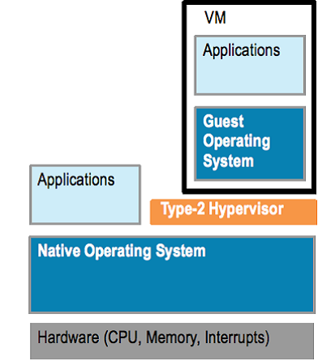

## Introduction to Docker

Ganesh Pagade  
Mar 2017

---

## Overview

1. OS Level Virtualization
1. Docker Architecture
1. Docker Setup
1. Docker Containers
1. Docker Images
1. Docker Volumes
1. Docker Networking
1. Docker Compose
1. Docker Swarm
1. Kubernetes
1. Reference Material

Note:
- Slides and other material used in this training is shared online.
- We have lots to cover. Usually a 3 full day training is conducted.

---

## About Me

- 12+ years in software engineering/architecture <!-- .element: class="fragment" data-fragment-index="1" -->
- Masters in CS from University of Pune <!-- .element: class="fragment" data-fragment-index="2" -->
- 1+ year in HPE - Cloud Optimizer <!-- .element: class="fragment" data-fragment-index="3" -->
- Interested in Distributed Computing, Microservices, Containers and DevOps <!-- .element: class="fragment" data-fragment-index="4" -->
- <!-- .element: class="fragment" data-fragment-index="5" --> [http://www.rockoder.com](http://www.rockoder.com)

---

## Virtualization

 <!-- .element: class="fragment" data-fragment-index="1" -->
 <!-- .element: class="fragment" data-fragment-index="2" -->

- Type 1: ESXi, Xen   <!-- .element: class="fragment" data-fragment-index="3" -->
- Type 2: VirtualBox, VMware Player <!-- .element: class="fragment" data-fragment-index="4" -->

Note:
- To better utilize hardware
- To reduce cost

---

### Virtual Machines vs Containers

 <!-- .element: class="fragment" data-fragment-index="1" -->
 <!-- .element: class="fragment" data-fragment-index="2" -->
- Container Engine  <!-- .element: class="fragment" data-fragment-index="3" -->
  - Solaris Zones, LXC, Docker, Rocket <!-- .element: class="fragment" data-fragment-index="3" -->

-----

### Virtual Machines vs Containers


-----

### Virtual Machines vs Containers

- Virtual Machines
  - Heavy, Slow Provisioning <!-- .element: class="fragment" data-fragment-index="1" -->
  - Good Isolation <!-- .element: class="fragment" data-fragment-index="2" -->
  - Can Run Different Family of OS Than Host<!-- .element: class="fragment" data-fragment-index="3" -->

----------

- Containers
  - Light, Faster Provisioning <!-- .element: class="fragment" data-fragment-index="1" -->
  - Poorer Isolation <!-- .element: class="fragment" data-fragment-index="2" -->
  - Shared Kernel, Need Same Family of OS<!-- .element: class="fragment" data-fragment-index="3" -->

---

## Docker Installation

```bash
$ sudo apt-get update

$ sudo apt-get install \
    linux-image-extra-$(uname -r) \
    linux-image-extra-virtual

$ sudo apt-get install \
    apt-transport-https \
    ca-certificates \
    curl \
    software-properties-common

$ curl -fsSL https://download.docker.com/linux/ubuntu/gpg \|
    sudo apt-key add -

$ sudo apt-key fingerprint 0EBFCD88

$ sudo add-apt-repository \
   "deb [arch=amd64] https://download.docker.com/linux/ubuntu \
   $(lsb_release -cs) \
   stable"

$ sudo apt-get install docker-ce
```

- [Ubuntu Installation](https://docs.docker.com/engine/installation/linux/ubuntu/)

-----

## Additonal Configuration

```bash
$ sudo groupadd docker

$ sudo usermod -aG docker $USER
```

- [Post install configuration](https://docs.docker.com/engine/installation/linux/linux-postinstall)

---

## Docker Containers

```bash
$ docker run ubuntu

$ docker run ubuntu ls

$ docker run -it ubuntu /bin/bash

$ docker ps

$ docker ps -a

$ docker rm <container id>/<container name>
```

https://docs.docker.com/engine/reference/commandline/run/

---

## Next Slide

Note:
- Presenter note

---

## Reference Material

- Link to convert/download PDF of the presentation

---

## Thank You
