## Introduction to Docker

Ganesh Pagade  
Mar 2017

---

### Overview

1. Virtualization <!-- .element: class="fragment" data-fragment-index="1" -->
1. Docker Architecture <!-- .element: class="fragment" data-fragment-index="2" -->
1. Docker Containers and Images <!-- .element: class="fragment" data-fragment-index="3" -->
1. Docker Networking and Volumes <!-- .element: class="fragment" data-fragment-index="4" -->
1. Docker Compose and Swarm <!-- .element: class="fragment" data-fragment-index="5" -->
1. Kubernetes <!-- .element: class="fragment" data-fragment-index="6" -->

Note:
- The Context
  - Virtualization, Containers, Why now?
- The Details
- The Application
- Slides and other material used in this training is shared online.
  - Verbose as much as possible
- We have lots to cover. Usually a 3 full day training is conducted.

-----

### About Me

- 12+ years in software engineering/architecture <!-- .element: class="fragment" data-fragment-index="1" -->
- Masters in CS from University of Pune <!-- .element: class="fragment" data-fragment-index="2" -->
- 1+ year in HPE - Cloud Optimizer <!-- .element: class="fragment" data-fragment-index="3" -->
- Interested in Distributed Computing, Microservices, Containers and DevOps <!-- .element: class="fragment" data-fragment-index="4" -->
- <!-- .element: class="fragment" data-fragment-index="5" --> [https://rockoder.github.io/](https://rockoder.github.io/)
- <!-- .element: class="fragment" data-fragment-index="6" --> [https://rockoder.github.io/introduction_to_docker](https://rockoder.github.io/introduction_to_docker)

---

### Long long time ago...

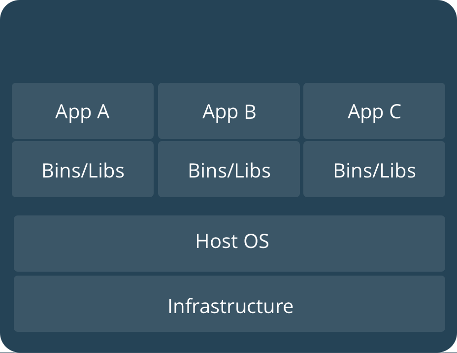 <!-- .element: class="fragment" data-fragment-index="1" -->

Physical <!-- .element: class="fragment" data-fragment-index="2" -->

-----

### Virtualization

 <!-- .element: class="fragment" data-fragment-index="1" -->
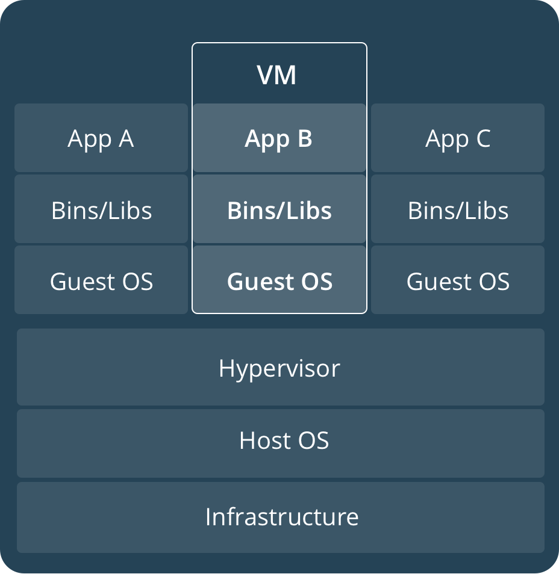 <!-- .element: class="fragment" data-fragment-index="3" -->
 <!-- .element: class="fragment" data-fragment-index="5" -->

- Type 1: ESXi, Xen   <!-- .element: class="fragment" data-fragment-index="2" -->
- Type 2: VirtualBox, VMware Workstation <!-- .element: class="fragment" data-fragment-index="4" -->
- Container Engine: Solaris Zones, Docker, Rocket <!-- .element: class="fragment" data-fragment-index="6" -->

Note:
- To better utilize hardware
- To reduce cost
- Containers - OS Virtualization
- Differences
  - Virtual Machines
    - Full OS and application
    - Heavy, Slow Provisioning (start/stop slow)
    - Good Isolation
    - Full blown OS
    - Can Run Different Family of OS Than Host
  - Containers
    - Single process and its dependencies
    - Light, Faster Provisioning (start/stop fast)
    - Poorer Isolation
    - Shared Kernel
    - Need Same Family of OS 

-----

### VMs + Containers


- VMs + Containers = Flexibility <!-- .element: class="fragment" data-fragment-index="1" -->

---

### Docker Internals - chroot

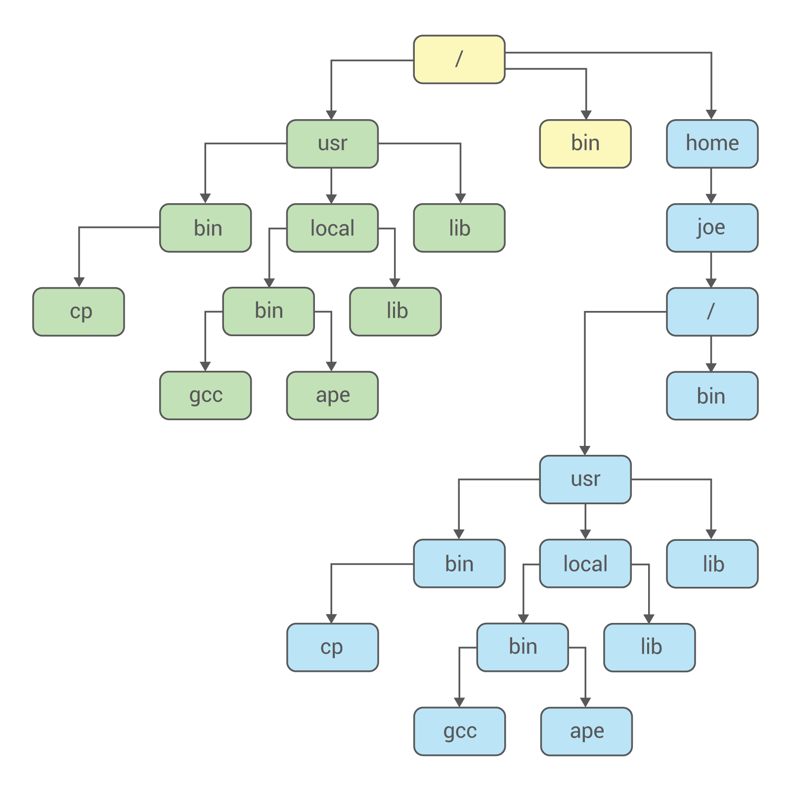

- chroot - changes current and root directory for a process <!-- .element: class="fragment" data-fragment-index="1" -->

Note:
  - OS Level Virtualization

-----

### Docker Internals - namespaces

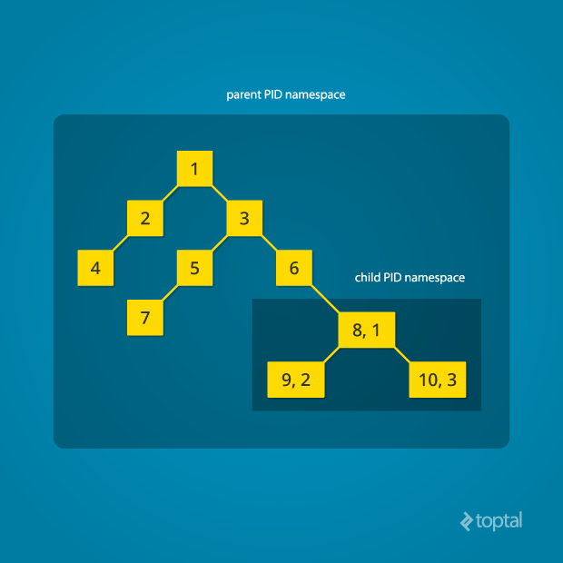

- namespaces - isolation of process tree, mounts, network, users, hostnames <!-- .element: class="fragment" data-fragment-index="1" -->

-----

### Docker Internals - cgroups

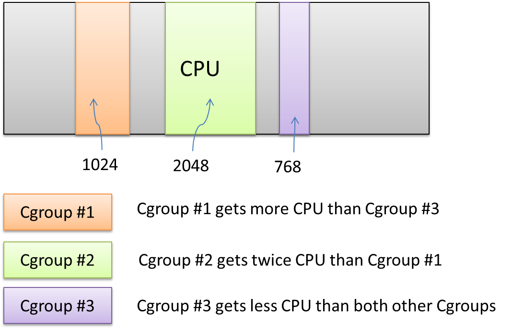

- cgroups - isolates and limits resources like cpu, memory etc <!-- .element: class="fragment" data-fragment-index="1" -->

Note:
  - Control Groups

-----

### Docker Internals - LXC

- LinuX Containers <!-- .element: class="fragment" data-fragment-index="1" -->
- LXC is a userspace interface for the Linux kernel containment features <!-- .element: class="fragment" data-fragment-index="2" -->
- Older Docker release was based on LXC <!-- .element: class="fragment" data-fragment-index="3" -->

-----

### Docker Internals - runC

- runC is a lightweight, portable container runtime <!-- .element: class="fragment" data-fragment-index="1" -->
- Used by Docker <!-- .element: class="fragment" data-fragment-index="2" -->
- Contains all of the plumbing code used by Docker to interact with system features <!-- .element: class="fragment" data-fragment-index="3" -->

Note:
It includes all of the plumbing code used by Docker to interact with system features related to containers.

---

### So What is Docker?

- Abstraction on container engine <!-- .element: class="fragment" data-fragment-index="1" -->
- Command line and HTTP API <!-- .element: class="fragment" data-fragment-index="2" -->
- Standardized packaging for app and libraries <!-- .element: class="fragment" data-fragment-index="3" -->
- Layered image format <!-- .element: class="fragment" data-fragment-index="4" -->
- Ecosystem of tools and services <!-- .element: class="fragment" data-fragment-index="5" -->
- Software container platform <!-- .element: class="fragment" data-fragment-index="6" -->

---

<!-- ## Why are containers so popular?

- Dev, QA, Prod - Story of a SaaS based e-commerce portal
- No more: "It works on my machine"
- Immutable containers

---
 -->

### Docker Engine

<!-- .slide: data-transition="fade-in none-out" -->


Note:
- Actually a client/server application
- docker binary accepts commands and send to Docker daemon
  - via TCP Socket or HTTP

-----

### Docker Engine

<!-- .slide: data-transition="none-in fade-out" -->

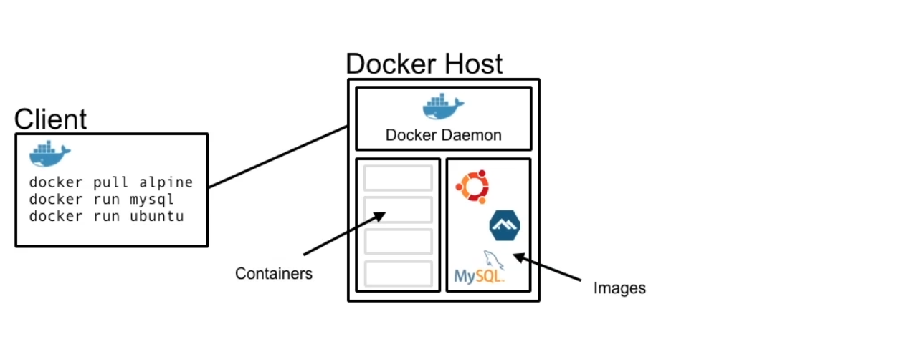

Note:
- Client and Docker Host can be on different machines
- Docker Host exposes the HTTP API

-----

### Docker Engine

<!-- .slide: data-transition="none-in fade-out" -->

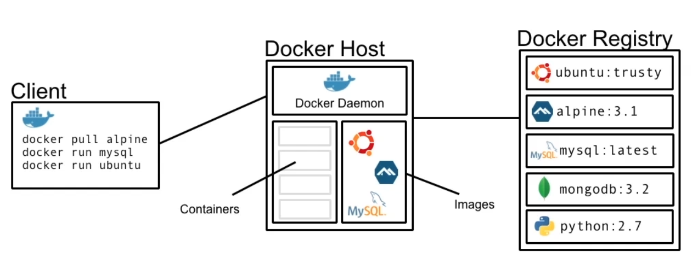

Note:
- official registry is docker hub
- contributed by 3rd party vendors, devs, docker
- most app now has docker containers
- the flow

---

### Docker Installation

```bash
$ sudo apt-get update
$ sudo apt-get install linux-image-extra-$(uname -r) \
    linux-image-extra-virtual
$ sudo apt-get install apt-transport-https \
    ca-certificates curl software-properties-common
$ curl -fsSL https://download.docker.com/linux/ubuntu/gpg |
    sudo apt-key add -
$ sudo apt-key fingerprint 0EBFCD88
$ sudo add-apt-repository \
   "deb [arch=amd64] https://download.docker.com/linux/ubuntu \
   $(lsb_release -cs) stable"
$ sudo apt-get update
$ sudo apt-get install docker-ce
```

[Ubuntu installation](https://docs.docker.com/engine/installation/linux/ubuntu/)

Note:
- If required, set http_proxy and https_proxy in /etc/environment file. Ex:
  - export http_proxy=http://web-proxy.in.hpecorp.net:8080
  - export https_proxy=https://web-proxy.in.hpecorp.net:8080
  - CE - Community Edition

-----

### Additonal Configuration

```bash
$ sudo groupadd docker
$ sudo usermod -aG docker $USER

# logout and login back for changes to apply
```

[Post install configuration](https://docs.docker.com/engine/installation/linux/linux-postinstall)

-----

### Docker Registry or Docker Hub

- Central repository for image discovery, distribution and change management <!-- .element: class="fragment" data-fragment-index="1" -->
- <!-- .element: class="fragment" data-fragment-index="2" --> Public: [hub.docker.com](hub.docker.com) - create account
- <!-- .element: class="fragment" data-fragment-index="3" --> Private: [hub.docker.hpecorp.net](hub.docker.hpecorp.net)

Note:
- Create account on hub.docker.com

---

### First Container

```bash
$ docker run ubuntu
$ docker run ubuntu pwd
$ pwd
$ docker run ubuntu ls
$ docker run ubuntu ls -l
$ docker run -it ubuntu /bin/bash
    $ hostname
    $ ps -ef
    $ ls -l
$ docker ps
$ docker ps -a
$ docker rm <container id>/<container name>
$ docker images
$ docker rmi <image id>/<image name>
```

Note:
- container runs the single process identified with PID 1
  - although other processes can run, container Lifecycle is tide with PID 1
    - when PID 1 completes/dies, container stops/dies
- default command to run at the start can be provided by default in the docker image
- or user can provide a command to run at the start

- docker run <image_name>

- run command pulls the image if it is not locally present

- container pwd output is different than the host pwd
  - container has the own isolated view of the OS
- this is a short lived container only to execute pwd command
- to go inside the container for some investigation, use -i (interactive) -t (terminal)
- easy to simulate a different distribution environment
  - by just installing that userland software and pretending it's another distribution

-----

### Detached Container

```bash
$ docker run alpine pwd
$ docker run training/webapp
$ docker run -p 5000:5000 training/webapp
$ docker run -d -p 5000:5000 training/webapp
$ docker ps
$ docker logs <container id>
$ docker stop <container id>
$ docker run -d --name webapp -p 5000:5000 training/webapp
$ docker restart <container id>
```

Note:
- `-d` - long running containers in detach mode
- `-p` to map host port to the container port
- `-P` randomly map host ports to the container ports
  - to get the ports used:
    - `docker ps -l` - last run container
    - `docker port <container id>`
- containers use name to communicate

-----

### Configuration

```bash
$ docker run -e "STR1=HI" -e "STR2=BYE" ubuntu /bin/bash -c export
```

Note:
- earlier we use to use configuration files
- in docker the image is pre-baked
- pass the configuration at launch time as environment variables
- ex: jvm parameters etc

-----

### Container Lifecycle

```bash
$ docker run --name webapp training/webapp
$ docker ps
$ docker ps -a
$ docker restart webapp
$ docker stop webapp
$ docker stop --time 10 webapp
$ docker kill webapp
$ docker rm webapp
$ docker ps -a
$ docker rm -f webapp
$ docker rm -f `docker ps -qa`
```

Note:
- restart - runs the container in detached mode
- stop - send SIGTERM followed by SIGKILL signal
  - SIGKILL happens if container fails to terminate gracefully
  - time - seconds to wait before sending SIGKILL
    - should be sufficient enough for container to gracefully shutdown (resource cleanup etc)
- rm - cannot be undone

-----

### Container Debugging

```bash
$ docker run -d -P --name redis redis
$ docker logs redis
$ docker logs -f redis
$ docker inspect redis
$ docker exec -ti redis /bin/bash
  $ ps -ef
$ docker exec -ti redis ps -ef
```

Note:
- inspect - to get local ip of the container
- Redis container is running redis as primary process.
  - use `exec` to run the bash in the already container as a secondary process

-----

### Docker Images

- Using pre-built images is very useful <!-- .element: class="fragment" data-fragment-index="1" -->
- You can also create your own images <!-- .element: class="fragment" data-fragment-index="2" -->
- Create your own images based on pre-built images <!-- .element: class="fragment" data-fragment-index="3" -->
- Distribute them as easily as pre-built images <!-- .element: class="fragment" data-fragment-index="4" -->
- Makes the application/product highly portable <!-- .element: class="fragment" data-fragment-index="5" -->

---

### Docker Images

<!-- .slide: data-transition="fade-in none-out" -->


Note:
- To run on Linux needs to have Linux libraries and binaries
  - Cannot run Windows base OS on Linux host
- Falvor of Linux we pick, decide which libraries we can use
- Base image - Ubuntu - this is pre-built image

-----

### Docker Images

<!-- .slide: data-transition="none-in fade-out" -->


Note:
- install python

-----

### Docker Images

<!-- .slide: data-transition="none-in fade-out" -->

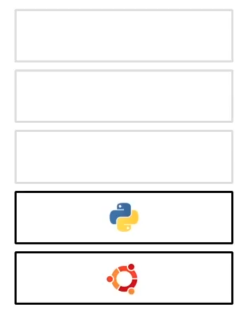

Note:
- Flask - Python based web framework

-----

### Docker Images

<!-- .slide: data-transition="none-in fade-out" -->

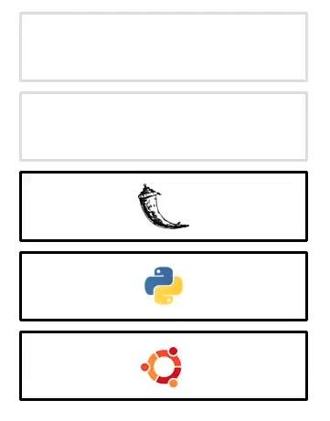

Note:
- Add your app code

-----

### Docker Images

<!-- .slide: data-transition="none-in fade-out" -->

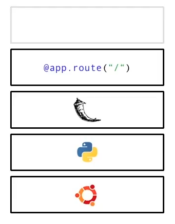
Note:
- Container acts like a machines in its own
- So need to explicitly expose ports that needs to be available outside the contianer

-----

### Docker Images

<!-- .slide: data-transition="none-in fade-out" -->

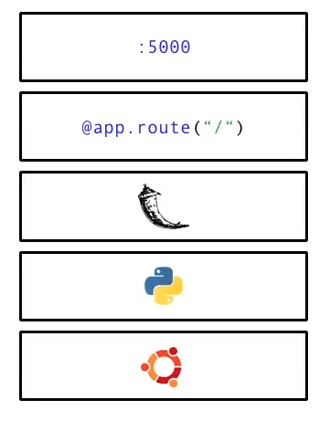

Note:
- Docker images are built from layers
- Layers are immutable
- Can't change them but create new once
- Can go back to any point and diverge
- We reuse layers that dont change
- Can name and tag any layer

-----

### Docker Images

- Run Container - Change State - Save State <!-- .element: class="fragment" data-fragment-index="1" -->
- Layer: Only difference is saved <!-- .element: class="fragment" data-fragment-index="2" -->
- Two ways to create: <!-- .element: class="fragment" data-fragment-index="3" -->
  - Manual <!-- .element: class="fragment" data-fragment-index="4" -->
  - Dockerfile <!-- .element: class="fragment" data-fragment-index="5" -->

Note:
- Images are created by running containers, changing their state and then saving the new state to disk
- When the new state is saved, only the difference introduced is saved forming layers
- Two ways to create images
  - Make changes to a running container and save the state to disk
  - Use Dockerfile
    - It lists instructions to be performed on the image to produce new layer

-----

### Docker Images

<!-- .slide: data-transition="none-in fade-out" -->


Note:
- FROM, RUN are Docker instructions

-----

### Docker Images

<!-- .slide: data-transition="none-in fade-out" -->

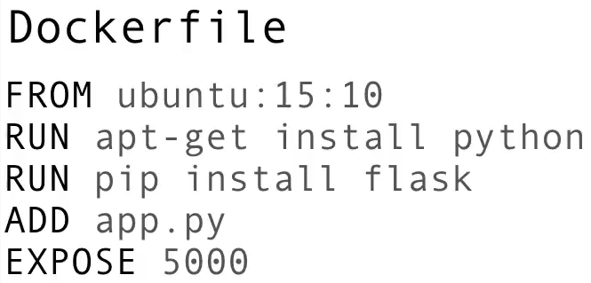
Note:
- We can put this file in version control
- Use it to create automated builds

-----

### Docker Hub

```bash
$ docker pull rabbitmq
$ docker pull rabbitmq:3.6-management
$ docker run -d -p 15672:15672 rabbitmq:3.6-management

# open host_ip:15672 in browser
```
<!-- .element: class="fragment" data-fragment-index="1" -->

[hub.docker.com](hub.docker.com) <!-- .element: class="fragment" data-fragment-index="2" -->

Note:
- rabbitmq
  - public contributed, prefixed with user/org name
  - official, follows best practises - preferred
  - tags - kind of version
    - latest - default tag

-----

### Docker Image

```bash
$ docker search alpine
$ docker images
$ docker pull alpine
$ docker images
```
Note:
- We will use alpine as our base image for our image

-----

### Dockerfile

```Dockerfile
FROM alpine
```
<!-- .element: class="fragment" data-fragment-index="1" --> 

```Dockerfile
MAINTAINER rickfast <rick.t.fast@gmail.com>
```
<!-- .element: class="fragment" data-fragment-index="2" -->

```Dockerfile
RUN apk update && apk add nodejs
```
<!-- .element: class="fragment" data-fragment-index="3" -->

```Dockerfile
RUN mkdir average
```
<!-- .element: class="fragment" data-fragment-index="4" -->

```Dockerfile
ADD average.js average/
```
<!-- .element: class="fragment" data-fragment-index="5" -->

```Dockerfile
WORKDIR average
```
<!-- .element: class="fragment" data-fragment-index="6" -->

```Dockerfile
ENTRYPOINT ["node","average.js"]
```
<!-- .element: class="fragment" data-fragment-index="7" -->

[download](demo_files/ex1_images/Dockerfile) <!-- .element: class="fragment" data-fragment-index="8" -->

Note:
- Dockerfile specifies list of instructions to build Docker image
- Sharable, Reprocible and Automatable Process
- Entrypoint defines the main process that will be run within the container
  - this is the pid 1

-----

### Sample Application

```Javascript
var sum = 0;
var count = 0;
process.argv.forEach(function (val, index, array) {
  if(index > 1) {
    sum += parseInt(val);
    count ++;
  }
});
console.log(sum / count);
```

[download](demo_files/ex1_images/average.js)

-----

### Build Docker Image

```bash
$ wget rockoder.github.io/introduction_to_docker/demo_files/ex1_images/average.js
$ wget rockoder.github.io/introduction_to_docker/demo_files/ex1_images/Dockerfile
$ docker build -t rockoder/average .
$ docker run rockoder/average 2 3 4
```

Note:
- ensure you are in a clean empty directory to fire wget
- `docker build` creates container from base images
- and executes instruction in the container and saves to a image layer
- Each line in Dockerfile is automic commit
- No need to mention the Entrypoint process in the docker run command

-----

### Push Docker Image

```bash
$ docker tag <image id> <dockerhub account name>/average:1.0
$ docker tag <image id> <dockerhub account name>/average:latest
$ docker images
$ docker login
$ docker push <dockerhub account name>/average
```

```bash
# Login to private Docker registry
$ docker login https://hub.docker.hpecorp.net
```
<!-- .element: class="fragment" data-fragment-index="1" -->

Note:
- Same image can have multiple tags
- Push and check on hub.docker.com

---

### Docker Networking


Note:
- An app can consist of multiple containers like web server, cache, db etc
- These containers need to run on the same network to interact with each other
- They way containers are isolated, networks can also be isolated

-----

### Docker Networking

```bash
$ docker network ls
$ ifconfig
$ docker run -d -P --name default-network training/webapp
  $ ifconfig
$ docker run -d -P --net none --name no-network training/webapp
  $ ifconfig
$ docker run -d -P --net host --name host-network training/webapp
  $ ifconfig
```

Note:
- Docker by default runs three networks on the host
- default is bridge

-----

### Docker Networking

```bash
$ docker network create --driver bridge my-network
$ docker network ls
$ docker run -d --net my-network --name webapp training/webapp
$ docker run alpine wget -qO- webapp:5000
$ docker run --net my-network alpine wget -qO- webapp:5000
```

---

### Docker Volumes

- Stateless services <!-- .element: class="fragment" data-fragment-index="1" -->
  - Don't save any persistent state <!-- .element: class="fragment" data-fragment-index="2" -->
  - Remain portable and scalable <!-- .element: class="fragment" data-fragment-index="3" -->
- Persistent state cannot be stored within container <!-- .element: class="fragment" data-fragment-index="4" -->
  - Containers will come and go <!-- .element: class="fragment" data-fragment-index="5" -->
- Data volumes are directories to store persistent data <!-- .element: class="fragment" data-fragment-index="6" -->

-----

### Docker Volumes

```bash
$ docker run -d -p 5984:5984 \
  -v $(pwd)/data:/usr/local/var/lib/couchdb \
  --name couchdb klaemo/couchdb:1.6
$ curl -X PUT http://localhost:5984/db
$ ls data/
$ curl -H 'Content-Type: application/json' \
  -X POST http://localhost:5984/db \
  -d '{"value":"Hello Docker World!"}'
$ curl http://localhost:5984/db/<id>
$ docker rm -f <couchdb container id>
$ docker run -d -p 5984:5984 \
  -v $(pwd)/data:/usr/local/var/lib/couchdb 
  --name couchdb_new klaemo/couchdb:1.6
$ curl http://localhost:5984/db/<id>
```

Note:
- couchdb state is stored in external directory data/
- Even if we remove the couchdb container the data will remain
- Which can be used by the new couchdb container

---

### Docker Compose

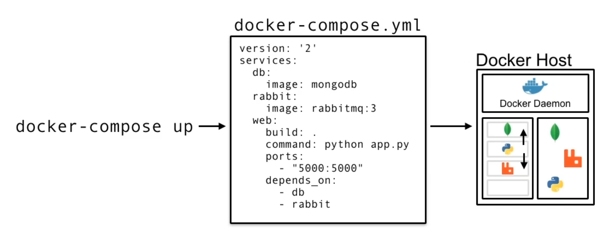

Note:
- Another tool in the Docker ecosystem
- Document defining containers and their relationships
- Helps in container orchestration
- Helps in running the containers in correct order

-----

### Docker Compose - Installation

```bash
$ sudo -i
$ curl -L "https://github.com/docker/compose/releases/download/1.11.2/docker-compose-$(uname -s)-$(uname -m)" \
  -o /usr/local/bin/docker-compose
$ chmod +x /usr/local/bin/docker-compose
$ exit
$ docker-compose --version
```

[Docker Compose Installation](https://docs.docker.com/compose/install/)

-----

### Docker Compose - Example

```yaml
version: "2"
services:
  kv-store-1:
    image: redis
  kv-store-2:
    image: redis
```

[download](demo_files/ex2_compose/docker-compose.yml)

Note:
- Docker Compose yaml specification version 2
- services - list of containers
- kv-store-1 - container name
- attributes - options of the docker run command

-----

### Docker Compose - Example

```bash
$ wget rockoder.github.io/introduction_to_docker/demo_files/ex2_compose/docker-compose.yml
$ docker-compose up
$ docker-compose up -d
$ docker-compose stop
$ docker-compose rm
```

Note:
- Notices the container name at each log line.
- Helpful when we run multiple containers
- `-d` for detached mode. Will restart the stopped containers

-----

### Docker Compose - ELK Stack

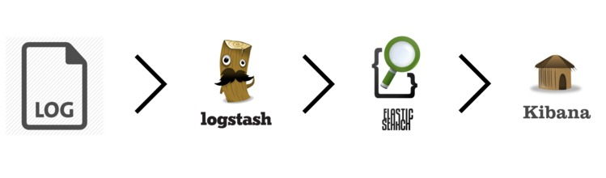

-----

### Docker Compose - ELK Stack

```yaml
version: '2'
services:
  elasticsearch:
    image: elasticsearch:2.2.1
  kibana:
    image: kibana:4.4.2
    ports:
      - "5601:5601"
    environment:
      - ELASTICSEARCH_URL=http://elasticsearch:9200
    depends_on:
      - elasticsearch
  logstash:
    image: logstash:2.2.2
    command: -e 'input { tcp { port => 5555 } } output { elasticsearch { hosts => ["elasticsearch:9200"] } }'
    ports:
      - "5555:5555"
    depends_on:
      - elasticsearch
```

[download](demo_files/ex3_elk/docker-compose.yml)

-----

### Docker Compose - ELK Stack

```bash
$ docker-compose up -d
$ echo Hello Docker | nc localhost 5555

# Now to go host_ip:5601 in browser
# Click Create button at the bottom
# Click Discover at the top
```

---

### Docker Swarm

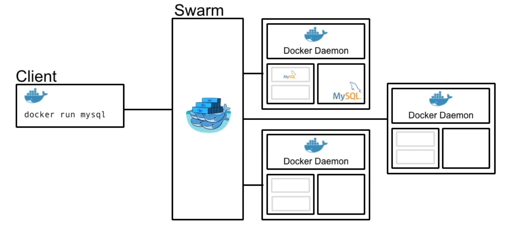

Note:
- Old diagram
- Allows to run containers across group of Docker Hosts
- `docker init` makes the Docker Engine run in swarm mode
  - has built in key-value store

-----

### Docker Swarm - Creation

```bash
# node1 becomes the master
$ docker swarm init --advertise-addr <node1_ip>

# on node2. node2 becomes the worker
$ docker swarm join \
  --token <token_from_above_command> \
  <node1_ip>:2377

# on master
$ docker info
$ docker node ls
```

-----

### Docker Swarm - Service Creation

```bash
# on master
$ docker service create --replicas 1 \
  --name helloworld alpine ping docker.com

$ docker service ls

# on master and worker
$ docker ps
```

-----

### Docker Swarm - Service Scale

```bash
# on master
$ docker service inspect --pretty helloworld
$ docker service ps helloworld
$ docker service scale helloworld=5
$ docker service ps helloworld

# run on master and worker
$ docker ps
```

-----

### Docker Swarm - Service Deletion

```bash
# on master
$ docker service rm helloworld
$ docker node ls
```

-----

### Docker Swarm - Deletion

```bash
# on worker node
$ docker swarm leave

# on master
$ docker node ls

# on master, use only for single-node swarm
$ docker swarm leave --force

```

---

### Kubernetes

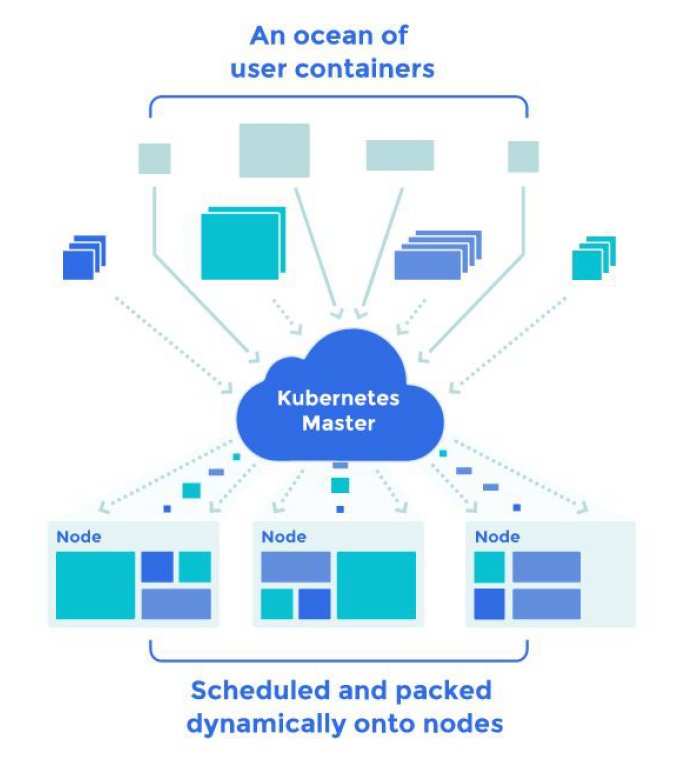

Note:
- Kubernetes is a powerful system, developed by Google, for managing containerized applications in a clustered environment.
- It aims to provide better ways of managing related, distributed components across varied infrastructure.

---

### Reference Material

1. [Learing Docker](https://www.safaribooksonline.com/library/view/learning-docker)
1. https://docs.docker.com/
1. https://linuxcontainers.org/
1. https://wiki.gentoo.org/wiki/LXC
1. https://www.toptal.com/linux/separation-anxiety-isolating-your-system-with-linux-namespaces
1. http://docker-saigon.github.io/post/Docker-Internals/
1. https://blog.selectel.com/containerization-mechanisms-namespaces/
1. https://kubernetes.io/
